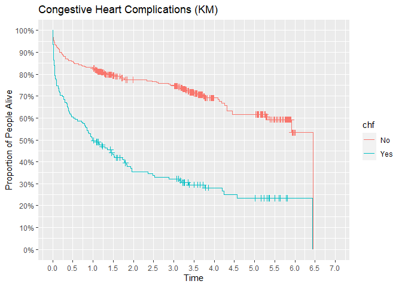

## Repo Overview

This repo explores two classic statistical models for survival analysis
using patients who experienced myocardial infarctions.

Models:

- Kaplan-Meier
- Cox Proportional Hazards

## Censoring

Right censoring occurs when the event of interest is yet to be observed
for some data. Examples include time to death for patients with a
terminal illness, time to relapse for patients in rehab, or time to
service termination for customers. Here are three hypothetical data
points.

    # A tibble: 3 × 2
       Time Event
      <dbl> <dbl>
    1     1     0
    2     2     1
    3     3     1

The average of time is not two. Due to the first observation being
censored, the average is **at least** two. Unless all data points are
uncensored, this “at least” affects all summary statistics, hypothesis
tests, and models. Survival analysis is the area of statistics designed
to deal with this notion of “at least” inherent in the data.

## Data Overview

The data set includes 500 patients who suffered a heart attack.

Variables:

- id - Identification Code (1 - 500)
- age - Age at Hospital Admission (years)
- gender - Gender (0 = Male, 1 = Female)
- hr - Initial Heart Rate (Beats per minute)
- sysbp - Initial Systolic Blood Pressure (mmHg)
- diasbp - Initial Diastolic Blood Pressure (mmHg)
- bmi - Body Mass Index (kg/m^2)
- cvd - History of Cardiovascular Disease (0 = No, 1 = Yes)
- afb - Atrial Fibrillation (0 = No, 1 = Yes)
- sho - Cardiogenic Shock (0 = No, 1 = Yes)
- chf - Congestive Heart Complications (0 = No, 1 = Yes)
- av3 - Complete Heart Block (0 = No, 1 = Yes)
- miord - MI Order (0 = First, 1 = Recurrent)
- mitype - MI Type (0 = non Q-wave, 1 = Q-wave)
- year - Cohort Year
- admitdate - Hospital Admission Date
- disdate - Hospital Discharge Date
- fdate - Date of last Follow Up
- los - Length of Hospital Stay
- dstat - Discharge Status from Hospital (0 = Alive, 1 = Dead)
- lenfol - Total Length of Follow-up
- fstat - Vital Status at Last Follow-up (0 = Alive 1 = Dead)

The first ten rows look like

    # A tibble: 500 × 22
          id   age gender    hr sysbp diasbp   bmi   cvd   afb   sho   chf   av3
       <dbl> <dbl>  <dbl> <dbl> <dbl>  <dbl> <dbl> <dbl> <dbl> <dbl> <dbl> <dbl>
     1     1    83      0    89   152     78  25.5     1     1     0     0     0
     2     2    49      0    84   120     60  24.0     1     0     0     0     0
     3     3    70      1    83   147     88  22.1     0     0     0     0     0
     4     4    70      0    65   123     76  26.6     1     0     0     1     0
     5     5    70      0    63   135     85  24.4     1     0     0     0     0
     6     6    70      0    76    83     54  23.2     1     0     0     0     1
     7     7    57      0    73   191    116  39.5     1     0     0     0     0
     8     8    55      0    91   147     95  27.1     1     0     0     0     0
     9     9    88      1    63   209    100  27.4     1     0     0     1     0
    10    10    54      0   104   166    106  25.5     1     0     0     0     0
    # ℹ 490 more rows
    # ℹ 10 more variables: miord <dbl>, mitype <dbl>, year <dbl>, admitdata <chr>,
    #   disdate <chr>, fdate <chr>, los <dbl>, dstat <dbl>, lenfol <dbl>,
    #   fstat <dbl>

## Kaplan-Meier Model

The Kaplan-Meier model is a non-parametric model. This model makes no
distributional assumptions about survival time. The main output is a
survival curve.

According to the curve, an estimated 70% of patients live at least 1.25
years after being admitted to the hospital for a myocardial infarction.

The KM approach can be used to compare different groups. Are congestive
heart complications associated with worse survival? Visually, the green
survival curve is much lower than the red survival curve indicating
patients with complications die sooner than patients without.

Could this difference in survival be attributed to random chance alone?
The log rank test shows a p-value below 5% indicating no. Complications
are associated with worse survival.

    Call:
    survdiff(formula = Surv(lenfol, fstat) ~ afb, data = whas500_02)

            N Observed Expected (O-E)^2/E (O-E)^2/V
    afb=0 422      168    184.8      1.52      10.9
    afb=1  78       47     30.2      9.31      10.9

     Chisq= 10.9  on 1 degrees of freedom, p= 0.001 

The Kaplan-Meier model can be used as a descriptive tool or a inference
tool. For inference, all other factors are ignored. This possible issue
is addressed by the next model.

# Cox Proportional Hazards Model

The Cox Proportional Hazards model is an inference tool that controls
other variables that possibly influence survival time. It does this by
assuming a semi-parametric relationship between the hazard function and
explanatory variables. With this model, a survival curve can be
calculated.

According to this model, an estimated 70% of patients live at least 3.25
years after being admitted.

                  coef exp(coef)    se(coef)         z     Pr(>|z|)
    age     0.05723802 1.0589078 0.006417813  8.918617 4.721482e-19
    chf     0.84655007 2.3315891 0.144915759  5.841670 5.168004e-09
    sho     1.05101250 2.8605460 0.267750715  3.925340 8.660745e-05
    gender -0.18200553 0.8335967 0.141142629 -1.289515 1.972191e-01
    mitype -0.41349385 0.6613356 0.178263485 -2.319566 2.036439e-02

Ignoring the inflated type I error rate, risk of death increases with:

- Increases in age
- Congestive heart complications
- Cardiogenic shock

Risk of death decreases with:

- Being male
- Having a Q-wave heart attack instead of a non Q-wave.

Note Q-wave itself may not be protective. It is possible Q-wave heart
attacks are easier to identify leading to earlier patient escalation and
therefore better survival.

# Survival Curve Comparison

The two models lead to meaningfully different survival curves. This is
due to the difference in model assumptions. Under the hood, the
Proportional Hazards model uses the Nelson-Aalen estimator of survival
instead of the Kaplan-Meier estimator.

The K.M. estimator will never be greater than the N.A. estimator.
Depending on observed data, it is possible the two estimators are
functionally equal.

# Other tools

This repo focuses on the two main tools of survival analysis used in
medical research. Accelerated Failure Time (A.F.T.) models and tree
based methods are two other approaches. A.F.T. models make a fully
parametric assumption between covariates and failure time. This allows
the models to estimate median failure time which is something the Cox
Proportional Hazards model cannot do. Tree based methods take the
likelihood functions used by other survival models (either Cox or
A.F.T.) and replace the weighted sum of covariates with tree functions.
With these new loss functions, training boosted models or random forests
continue as usual. At time of writing, XGBoost has the functionality
while LightGBM has it on the to-do list.
